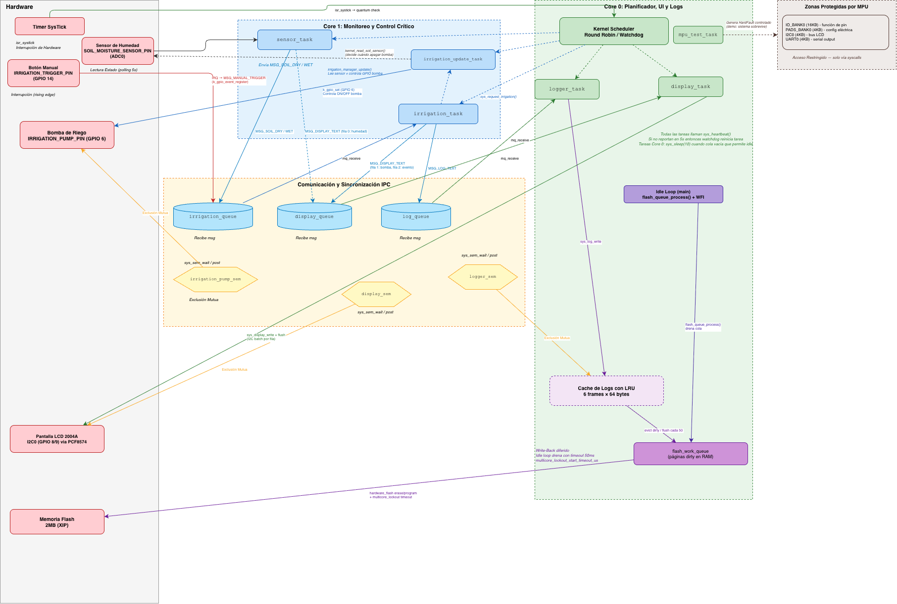

# Sistema de Riego Automático sobre PicoOS



Sistema operativo minimalista (PicoOS) que gestiona riego automático sobre Raspberry Pi Pico (RP2040). Implementa planificación Round-Robin, protección de memoria (MPU), syscalls, IPC por colas, page cache LRU con write-back diferido a Flash, y tolerancia a fallos.

## Documentación

- Reporte completo: [REPORTE.md](REPORTE.md)
- Video de funcionamiento: [ver video](https://canva.link/1fd4zm14b8c9oei)

## Características

- Scheduler Round-Robin preemptivo
- Multiprocesamiento dual-core (AMP)
- Protección de memoria mediante MPU
- Syscalls vía SVC (17 servicios)
- IPC por colas de mensajes inter-core
- Semáforos binarios
- Watchdog de tareas
- Page Cache LRU con write-back diferido
- Filesystem PicoFS sobre Flash
- LCD 2004A por I2C
- Riego automático y manual

## Arquitectura

```
Core 0 (Gestión)              Core 1 (Control Crítico)
├── logger_task                ├── irrigation_task
├── display_task               ├── sensor_task
└── mpu_test_task              └── irrigation_update_task

Kernel:
- Scheduler Round-Robin preemptivo
- MPU (5 regiones protegidas)
- 17 syscalls
- Flash Queue para write-back diferido

IPC: irrigation_queue | log_queue | display_queue | 3 Semáforos
```

## Conexionado

| Componente | GPIO | Pin Pico | Notas |
|-----------|------|----------|-------|
| Bomba (relevador) | 6 | Pin 9 | Activa en LOW, pull-down |
| Sensor humedad | 26 (ADC0) | Pin 31 | Analógico |
| Botón manual | 14 | Pin 19 | Pull-down, rising edge |
| LCD SDA | 8 | Pin 11 | I2C0, LCD 2004A (PCF8574) |
| LCD SCL | 9 | Pin 12 | I2C0, 400kHz |

## Compilación

### Requisitos

- [Pico SDK](https://github.com/raspberrypi/pico-sdk) (v1.5+)
- ARM GCC Toolchain (`arm-none-eabi-gcc` 10+)
- CMake (3.13+)

### Build

```bash
export PICO_SDK_PATH=/ruta/al/pico-sdk
mkdir build && cd build
cmake ..
make -j4
```

El binario resultante: `build/ProyectoFinal.uf2`

## Carga en la Pico

1. Mantener BOOTSEL presionado
2. Conectar USB → aparece como unidad `RPI-RP2`
3. Copiar el `.uf2`:

```bash
# macOS
cp build/ProyectoFinal.uf2 /Volumes/RPI-RP2/

# Linux
cp build/ProyectoFinal.uf2 /media/$USER/RPI-RP2/

# Windows
# Arrastrar ProyectoFinal.uf2 a la unidad RPI-RP2
```

4. La Pico se reinicia automáticamente

## Monitor Serial (Debug)

La Pico envía logs por USB CDC (serial virtual):

```bash
# macOS
screen /dev/tty.usbmodem* 115200

# Linux
minicom -D /dev/ttyACM0 -b 115200
```

## Uso

El sistema arranca automáticamente al conectar:

- **Sensor seco** (ADC > 2500): activa bomba, apaga cuando detecta humedad
- **Botón manual** (GPIO 14): activa un ciclo de riego de ~4s
- **Display LCD**: muestra humedad, estado bomba, último evento
- **Logs**: se almacenan en page cache (6 frames LRU) y se persisten a Flash

## Estructura del Proyecto

```
├── include/
│   ├── kernel/          # scheduler, mpu, syscalls, drivers, events, queues
│   ├── filesystem.h     # PicoFS API
│   ├── flash_queue.h    # Cola write-back diferido
│   ├── log_memory.h     # Page cache LRU
│   └── logger.h         # Logger persistente
├── src/
│   ├── main.c           # Boot dual-core, idle loop (flash worker)
│   ├── arch/            # pendsv.s, svc_handler.s, syscalls.s
│   ├── kernel/          # scheduler, mpu, drivers, filesystem, flash_queue
│   └── user/tasks/      # irrigation, sensor, logger, display, mpu_test
├── REPORTE.md           # Reporte académico completo
└── CMakeLists.txt
```
