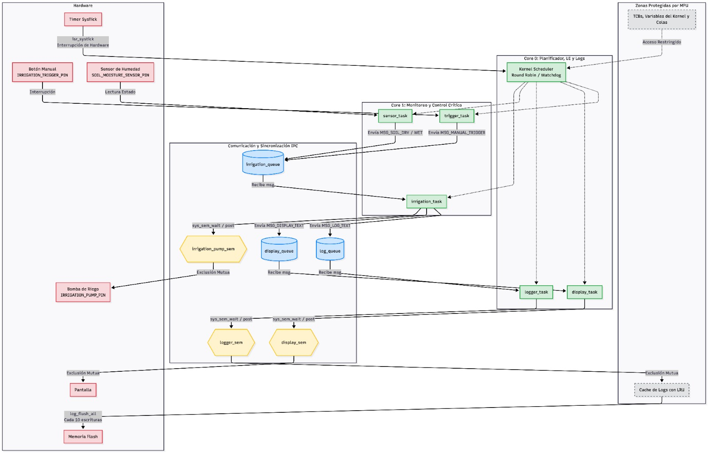
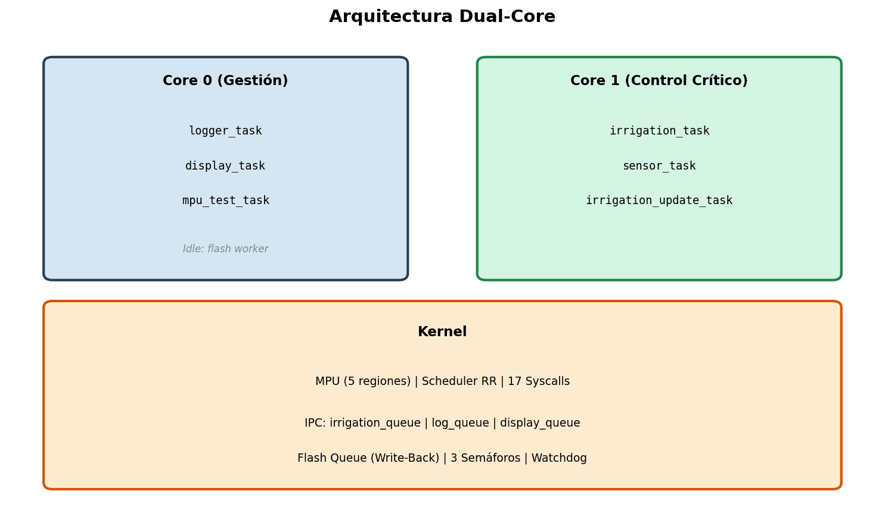
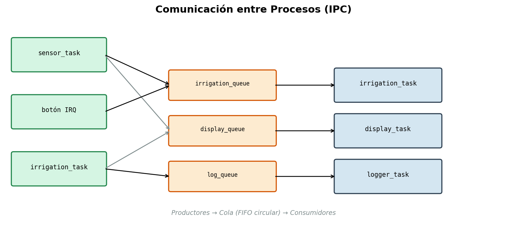
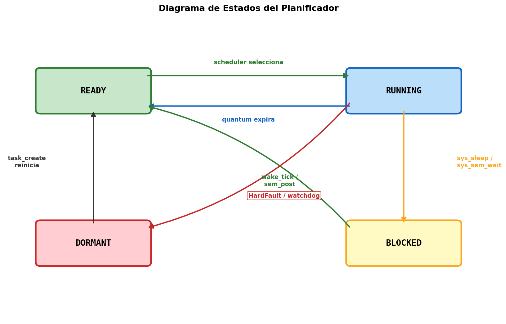
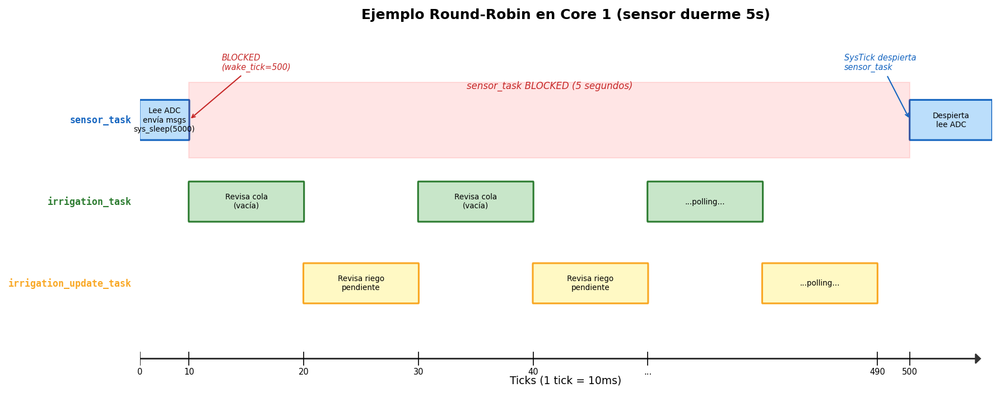
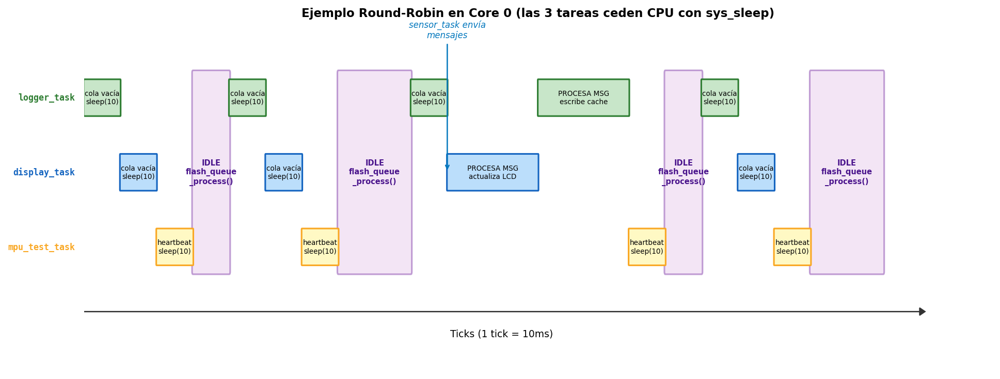
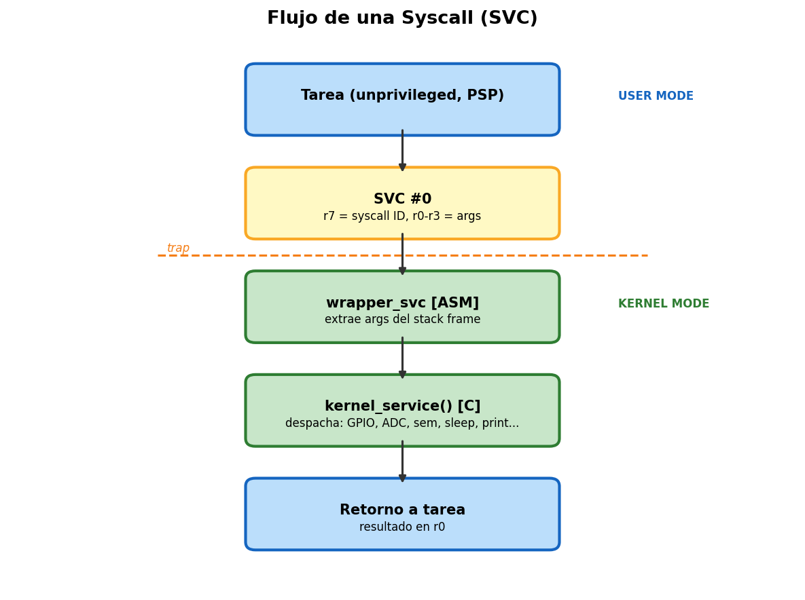
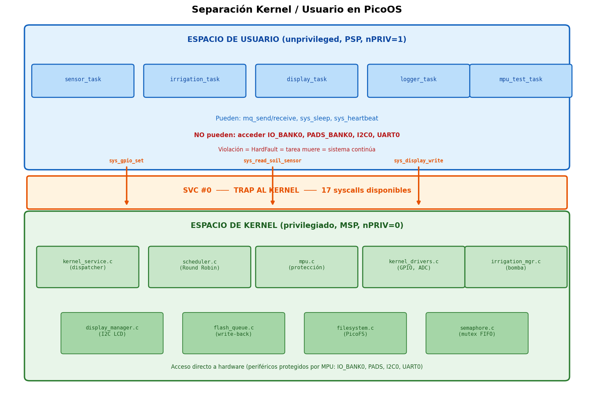
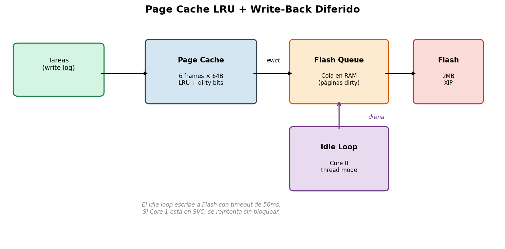

# Sistema de Riego Automático sobre PicoOS

**Sistemas Operativos 2026-2 (0713)**

**Plataforma:** Raspberry Pi Pico (RP2040 - Dual-core ARM Cortex-M0+ @ 125MHz)

**Repositorio:** https://github.com/jzarcoo/Sistema-de-Riego-Automatico-sobre-PicoOS

**Video de funcionamiento:** https://canva.link/1fd4zm14b8c9oei

---

## 1. Introducción

El riego manual de plantas es una tarea que se olvida fácilmente y que, cuando se hace de forma ineficiente, desperdicia agua y puede afectar a la planta en escasez como en exceso. Un sistema automático que mida la humedad del suelo y active el riego solo cuando es necesario resuelve estos problemas. Sin embargo, construirlo sobre un microcontrolador sin sistema operativo resulta en código monolítico difícil de mantener y sin garantías de seguridad.

Este proyecto aborda ese problema implementando un sistema operativo minimalista (PicoOS) sobre la Raspberry Pi Pico que gestiona el riego automático, esto como una extensión del PicoOS que se ha implementado en laboratorio a lo largo del semestre. El sistema lee un sensor de humedad, activa una bomba cuando el suelo está seco, permite riego manual por botón, muestra el estado en un LCD, y registra eventos en Flash. Todo esto corre sobre un kernel con separación de privilegios, protección de memoria por hardware, y planificación preemptiva en dos núcleos, mostrando las dificultades reales que aparecen cuando los conceptos de sistemas operativos se llevan a hardware físico.

---

## 2. Objetivos

- Diseñar una arquitectura de SO que separe el plano de control (tiempo real duro) del plano de gestión (tiempo real blando), comunicados exclusivamente por paso de mensajes.
- Implementar multiprocesamiento asimétrico: Core 1 para monitoreo y control crítico de hardware, Core 0 para planificación, UI y persistencia.
- Configurar la MPU para aislar el espacio de usuario del kernel, garantizando que una tarea defectuosa no pueda acceder a periféricos críticos como la bomba.
- Implementar un mecanismo de cache de páginas en RAM con política de reemplazo LRU y persistencia diferida sobre Flash.
- Garantizar tolerancia a fallos a nivel de SO: watchdog que detecta tareas colgadas o en deadlock y las reinicia sin afectar al núcleo de tiempo real.
---

## 3. Marco Teórico

### 3.1 Planificación de Procesos

Un scheduler Round-Robin asigna un quantum fijo a cada tarea. Cuando el quantum expira, el scheduler preempta la tarea y selecciona la siguiente en estado READY. En sistemas con múltiples cores, cada core puede ejecutar su propio scheduler. En esta implementación cada core ejecuta una instancia independiente del scheduler.

### 3.2 Protección de Memoria

La MPU (Memory Protection Unit) del RP2040 está basada en la arquitectura ARMv6-M y permite definir regiones de memoria protegidas. Es la única forma de protección de memoria disponible, ya que no tiene MMU ni paginación por hardware. La MPU permite definir hasta 8 regiones de memoria con permisos diferenciados entre modo privilegiado (kernel) y no privilegiado (tareas). Cada región se define con una dirección base, un tamaño (potencia de 2, mínimo 256 bytes), y bits de acceso (lectura, escritura, ejecución).

Si una tarea en modo no privilegiado intenta acceder a una región marcada como solo-kernel, el hardware genera un HardFault de forma inmediata y no hay forma de saltarse la protección por software porque es el propio bus de memoria quien la aplica.

### 3.3 Comunicación entre Procesos (IPC)

El modelo productor-consumidor usa colas de mensajes tipados. Las tareas productoras envían mensajes a una cola y las consumidoras los extraen. Este esquema desacopla las tareas y evita condiciones de carrera sin necesidad de memoria compartida explícita. En nuestro caso, es la única forma segura de comunicar tareas que corren en cores distintos, ya que no comparten scheduler ni stack.

### 3.4 Semáforos y Sincronización

Los semáforos implementados son binarios (valor inicial 1) y se utilizan como mutex para exclusión mutua. Si el recurso no está disponible, la tarea se bloquea y se encola en una cola FIFO; al liberar el recurso, se despierta la primera tarea en espera.

### 3.5 Page Cache y Políticas de Escritura

En sistemas operativos, una **página** es un bloque de tamaño fijo que sirve como unidad de transferencia entre RAM y almacenamiento. En este proyecto se utiliza la terminología "page cache" por analogía con sistemas operativos convencionales, aunque los bloques manejados tienen un tamaño fijo de 64 bytes debido a las restricciones del sistema. Cada página es un frame de 64 bytes en RAM que almacena un fragmento de log. El page cache mantiene las 6 páginas más recientes en RAM para evitar accesos costosos a Flash.

Cuando una tarea escribe un log, se almacena en un frame disponible. Si todos los frames están ocupados, el algoritmo **LRU (Least Recently Used)** selecciona la página que no se ha usado por más tiempo como víctima para desalojar, de forma que cada frame tiene un contador `last_used` que se actualiza en cada acceso, y se elige el frame con el valor más bajo. Si esa página víctima tiene datos modificados (está "dirty"), debe persistirse a Flash antes de ser reemplazada.

Existen dos políticas para decidir cuándo persistir una página dirty. **Write-Through** escribe a cache y a Flash simultáneamente: seguro pero lento. **Write-Back** escribe solo a cache y actualiza Flash después. Se consideró Write-Through inicialmente porque garantiza que los datos nunca se pierden, pero no fue viable: cada escritura a Flash en el RP2040 requiere pausar ambos cores con `multicore_lockout`, lo cual congelaba el plano de control crítico.

Se eligió **Write-Back**. Las escrituras se acumulan en RAM y la persistencia ocurre en dos etapas. Primero, `logger_task` acumula mensajes en el page cache; cada 50 mensajes llama `sys_log_flush()`, que toma todas las páginas dirty y las encola en `flash_work_queue`, esta operación solo mueve datos dentro de RAM y no toca Flash. Segundo, el idle loop de `main()` drena esa cola llamando `flash_queue_process()`, que es donde realmente se escribe a Flash usando `multicore_lockout` para pausar Core 1 de forma segura.

El idle loop corre cuando el scheduler no encuentra tareas READY. Como el sensor genera un log cada 5 segundos y el procesamiento de cada ciclo (leer ADC, enviar mensajes, actualizar display) es mucho más rápido que esos 5 segundos, entre un log y el siguiente hay tiempo para que el idle loop drene la cola.

El riesgo de pérdida de datos ante corte de energía es aceptable porque los logs de riego son informativos, no críticos para el funcionamiento del sistema.

### 3.6 Sistemas de Archivos

Una vez que las páginas dirty salen del page cache, necesitan un destino permanente. El filesystem es la capa que organiza esos datos en Flash para que sobrevivan reinicios del sistema.

Un filesystem minimalista sobre Flash requiere considerar que Flash solo puede borrarse por sectores completos (4KB) y programarse por páginas (256 bytes). Esto significa que escribir un solo byte requiere leer el sector completo a RAM, modificar el byte, borrar el sector, y reescribirlo entero (read-modify-write). En un sistema multicore, estas operaciones deben pausar el otro core para evitar que ejecute código desde Flash mientras esta se reprograma.

### 3.7 Tolerancia a Fallos

El watchdog detecta tareas que dejaron de reportar actividad y las reinicia automáticamente. El HardFault handler captura accesos inválidos detectados por la MPU y fuerza la terminación de la tarea responsable. La combinación de ambos mecanismos permite que el kernel sobreviva a fallos de tareas individuales.

---

## 4. Desarrollo

### Diagrama de Arquitectura Inicial

El siguiente diagrama fue la propuesta inicial del sistema, previo a la implementación:



### Diagrama Final del Sistema

Después de la implementación, el diagrama se actualizó para reflejar las decisiones de diseño tomadas durante el desarrollo (write-back diferido, eliminación de trigger_task pues no es polling sino una interrupción, irrigation_update_task separada):


### 4.1 Arquitectura Dual-Core



| Core | Rol | Tareas |
|------|-----|--------|
| Core 0 | Gestión, UI, logs | `logger_task`, `display_task`, `mpu_test_task` |
| Core 1 | Control crítico, bomba, sensor | `irrigation_task`, `sensor_task`, `irrigation_update_task` |

Cada core tiene su scheduler independiente con SysTick a 10ms. La separación permite que el control de la bomba y la lectura del sensor estén en Core 1 para garantizar que la latencia de I/O del display o del logger en Core 0 no afecte la respuesta del sistema de riego.

Esta división implementa la separación entre **plano de control** (tareas críticas con requisitos temporales estrictos, Core 1) y **plano de gestión** (tiempo real blando, Core 0). El plano de control prioriza tiempos de respuesta predecibles ante condiciones del suelo y nunca se bloquea por operaciones lentas como escritura a Flash o actualización del LCD. El plano de gestión tolera latencias variables porque sus tareas (logs, display) no tienen consecuencias físicas inmediatas si se retrasan.

**Comunicación inter-core:** Exclusivamente por colas de mensajes con deshabilitación de interrupciones para atomicidad.



### 4.2 Memory Protection Unit (MPU)

Se configuraron 5 regiones (1 background + 4 de protección):

| Región | Dirección | Tamaño | Acceso | Protege |
|--------|-----------|--------|--------|---------|
| 0 | 0x00000000 | 4GB | Full | Background (ROM, RAM, SIO) |
| 1 | 0x40014000 | 16KB | Solo kernel | IO_BANK0: función de pin |
| 2 | 0x4001C000 | 4KB | Solo kernel | PADS_BANK0: config eléctrica |
| 3 | 0x40044000 | 4KB | Solo kernel | I2C0: bus LCD |
| 4 | 0x40034000 | 4KB | Solo kernel | UART0: impide acceso directo, obliga a usar sys_print |

Si una tarea de usuario intenta acceder a estos periféricos directamente, la MPU genera HardFault. El handler mata la tarea y el sistema continúa operando.

**Nota sobre SIO (0xD0000000):** No se protege porque contiene el registro CPUID que el Pico SDK consulta desde `get_core_num()`, función usada en el scheduler, semáforos, syscalls y eventos para identificar en qué core se está ejecutando. La MPU del M0+ no permite proteger parte de un bloque. La bomba se protege indirectamente con IO_BANK0: sin acceso a IO_BANK0, una tarea no puede reconfigurar el pin de la bomba.

La MPU se configura con `PRIVDEFENA=1` y usa prioridad por número de región: la Región 0 (4GB, Full Access) permite acceso a todo como base, pero las regiones 1-4 (número más alto = mayor prioridad) sobreescriben esos permisos en las direcciones específicas de los periféricos protegidos. Entonces las tareas de usuario pueden acceder libremente a RAM y ROM, pero los 4 periféricos protegidos (IO_BANK0, PADS_BANK0, I2C0, UART0) generan HardFault si se acceden desde modo no privilegiado.

### 4.3 Planificador

- Round-Robin preemptivo con quantum de 10 ticks (100ms). Se eligió 100ms porque las tareas del sistema tienen periodos del orden de segundos (5s para el sensor), un quantum menor no aportaría beneficios apreciables y aumentaría el overhead de cambios de contexto.
- Conmutación de contexto vía PendSV.
- Estados posibles: DORMANT, READY, RUNNING, BLOCKED.
- Stack de 256 words (1KB) por tarea.
- El scheduler guarda R4-R11 manualmente porque el Cortex-M0+ no tiene instrucción STMDB.

**Transiciones de estado:**



**Sleep (`sys_sleep`):** Cuando una tarea llama `sys_sleep(ms)`, el kernel calcula `wake_tick = kernel_ticks + ms/10`, marca la tarea como BLOCKED, y dispara PendSV para ceder el procesador. En cada tick del SysTick, el scheduler revisa las tareas BLOCKED: si `kernel_ticks >= wake_tick`, la tarea vuelve a READY.

**Polling con yield:** Las colas no bloquean cuando están vacías. Se descartaron colas bloqueantes porque una tarea suspendida no puede reportar heartbeat (el watchdog la mataría). La implementación actual del watchdog considera únicamente actividad observable mediante heartbeat y por simplicidad no distingue entre espera legítima y bloqueo anómalo. En su lugar, las tareas hacen `sys_sleep(10)` cuando no hay mensajes, cediendo el CPU para que el idle loop drene la flash queue.

**Detección de tareas colgadas:** El scheduler implementa dos mecanismos. Primero, un watchdog por heartbeat: si una tarea no reporta `sys_heartbeat()` en 500 ticks (5 segundos), se reinicia con un stack fresco. Segundo, un supervisor de bloqueos: si una tarea lleva más de 500 ticks en estado BLOCKED sin `wake_tick` (posible deadlock en semáforo), se marca DORMANT y se recrea.

**Ejemplo de ejecución en Core 1** (3 tareas: sensor_task, irrigation_task, irrigation_update_task):



Mientras sensor_task duerme 5 segundos (500 ticks), el scheduler solo rota entre las tareas que están READY. Las tareas BLOCKED no consumen CPU.

En **Core 0** las tareas hacen polling de sus colas. Cuando no hay mensajes, llaman `sys_sleep(10)` para ceder el CPU. Como el sleep es de solo 1 tick y el procesamiento de cola vacía es instantáneo, las tres se bloquean en secuencia rápida dentro del mismo tick. En ese momento el scheduler no encuentra tareas READY y retorna a `main()`, donde el idle loop drena la flash queue.



### 4.4 Syscalls

El kernel expone 17 servicios vía instrucción SVC:



### 4.4.1 Separación Kernel / Usuario



El sistema implementa una separación de privilegios basada en MPU entre espacio de usuario y espacio de kernel usando los mecanismos de hardware del Cortex-M0+:

**Espacio de usuario (tareas):**
- Ejecutan con `nPRIV=1` (no privilegiado) y usan el PSP (Process Stack Pointer).
- No pueden acceder directamente a los periféricos protegidos por la MPU (IO_BANK0, PADS_BANK0, I2C0, UART0).
- Toda interacción con hardware pasa por syscalls (`SVC #0`).
- Si intentan acceder a una región protegida, la MPU genera HardFault y el kernel mata la tarea.

**Espacio de kernel:**
- Ejecuta con `nPRIV=0` (privilegiado) y usa el MSP (Main Stack Pointer).
- Tiene acceso total a todo el mapa de memoria.
- Incluye: scheduler, dispatcher de syscalls, drivers, MPU, filesystem, flash queue.
- El cambio de contexto (PendSV) configura `CONTROL` para alternar entre ambos modos.

**Transición usuario a kernel:** La instrucción `SVC` genera un trap síncrono. El handler en ASM (`wrapper_svc`) extrae los argumentos del stack frame de la tarea y llama a `kernel_service()` en C, que despacha según el ID del syscall. Al retornar, el hardware restaura el contexto de la tarea automáticamente.

### 4.5 Subsistema de I/O

La jerarquía de acceso a hardware sigue el patrón clásico de SO: las tareas de usuario invocan un syscall, que pasa por un device manager, luego al driver, y finalmente al hardware.

| Periférico | Técnica de acceso | Por qué se eligió esta técnica |
|-----------|---------|---------------|
| ADC (sensor de humedad) | Polling cada 5s vía syscall | La lectura es casi instantánea y solo se necesita cada 5 segundos por lo que no justifica una interrupción |
| GPIO botón (pin 14) | IRQ + triple sampling + debounce 500ms | El botón es un evento impredecible que debe atenderse inmediatamente. El filtro es por EMI del relevador |
| GPIO bomba (pin 6) | Escritura directa al SIO vía kernel | Solo necesita prender o apagar es solo un write a un registro |
| I2C LCD (PCF8574) | Double buffer + diff + batch por fila | Evita reescribir filas que no cambiaron, reduce tráfico I2C |
| UART (serial debug) | Syscall `sys_print` | La MPU protege UART0 por lo que las tareas no pueden acceder directamente |

Para el **Sensor de Humedad (ADC):** El sensor es un módulo capacitivo conectado a GPIO 26 (canal ADC0). El ADC del RP2040 es de 12 bits, lo que da un rango de 0 a 4095. Un valor alto indica suelo seco y un valor bajo indica suelo húmedo.

Los umbrales se calibraron empíricamente (prueba y error con el sensor en tierra seca, tierra húmeda, a la interperie y en agua):
- **ADC ~4100:** Sensor completamente seco (al aire) → 0% humedad
- **ADC ~1800:** Sensor en tierra recién regada → 100% humedad
- **Umbral de riego (2500):** Por encima de este valor se activa la bomba

El porcentaje se calcula con interpolación lineal entre estos dos extremos: `(4100 - valor) * 100 / (4100 - 1800)`. No hay una justificación teórica para los valores exactos, dependen del sensor específico, el tipo de tierra, y la profundidad de inserción. La conversión se hace por polling cada 5 segundos porque tarda poco y no justifica configurar una interrupción.

Para la **Bomba (GPIO):** El relevador se controla con GPIO 6 vía SIO (Single-cycle I/O), que permite prender o apagar un pin en un solo ciclo de reloj escribiendo directamente a los registros `SIO_GPIO_OUT_SET` o `SIO_GPIO_OUT_CLR`. La bomba se activa en LOW (por la lógica invertida del módulo relevador). El pin tiene un pull-down externo para que si el microcontrolador se reinicia o el pin queda flotante, la bomba permanezca apagada por defecto.

Para el **Display LCD 2004A** se implementó un driver con double buffer, diff por fila, y escritura batch por I2C. El driver es tolerante a desconexión: si el timeout I2C se dispara, se desactiva sin afectar al resto del sistema.

**Conexión física:** El LCD es una pantalla de 20 columnas × 4 filas. No se conecta directamente a la Pico sino a través de un módulo adaptador I2C (chip PCF8574) que viene soldado en la parte trasera del LCD. Este módulo convierte la comunicación I2C (de solo 2 cables SDA en GPIO 8 y SCL en GPIO 9) en las señales paralelas que el controlador interno del LCD (HD44780) necesita para funcionar.

La dirección I2C del módulo (0x27) se encontró haciendo un scan: se probaron todas las direcciones posibles (0x00 a 0x7F) y se vio en cuál respondía el dispositivo. El protocolo del HD44780 y cómo enviarle comandos se sacó del datasheet del chip y de ejemplos existentes para Arduino adaptados a la Pico.

Como el módulo PCF8574 solo tiene 8 pines de salida (y algunos se usan para señales de control como enable y backlight), el LCD opera en modo 4 bits: cada carácter se envía en dos mitades, lo que se traduce en 4 bytes I2C por cada carácter visible en pantalla. La velocidad del bus se configuró a 400kHz tras varias pruebas y notar que iba muy lenta en los 100kHz recomendados.

**Implementación:**

- **Posicionamiento por fila:** El HD44780 tiene un comando `SET_DDRAM` que mueve el cursor a una dirección de memoria. Cada fila empieza en una dirección fija (0x00, 0x40, 0x14, 0x54). Para escribir en una fila, se envía ese comando y después los 20 caracteres seguidos, el cursor avanza solo. Por eso la API es por fila completa y no por coordenada (fila, columna).
- **Double buffer (front/back):** El driver mantiene dos copias de las 4 filas en RAM. Las tareas escriben al back buffer vía syscall. En el flush, se compara cada fila del back contra el front con `memcmp` y así solo las filas que cambiaron se envían por I2C.
- **Batch por fila:** En vez de enviar carácter por carácter (lo cual sería 80 transacciones I2C por fila), se acumula toda la fila en un buffer de transmisión y se envía en una sola llamada a `i2c_write_timeout_us`.
- **API por filas:** `sys_display_write(fila, texto)` escribe una fila completa. Las tareas productoras indican qué fila actualizar:
  - Fila 0: humedad (sensor_task)
  - Fila 1: estado de la bomba (irrigation_task)
  - Fila 2: último evento (irrigation_task)
- **Tolerancia a desconexión:** Si el bus I2C falla 3 veces consecutivas, el driver marca `lcd_connected = false` y deja de intentar. Cada 50 ciclos intenta reconectar. Esto evita que un problema de conexión bloquee Core 0 con timeouts repetidos.

### 4.6 Semáforos

Se implementaron 3 mutex (semáforos binarios, valor inicial 1):
- `irrigation_pump_sem`: Exclusión mutua para la bomba.
- `logger_sem`: Exclusión mutua para operaciones de Flash.
- `display_sem`: Exclusión mutua para el LCD.

Internamente, cada semáforo tiene un contador de recursos y una cola circular de tareas esperando (máximo `SEM_MAX_WAITING`). La operación `wait` decrementa el contador; si queda negativo, la tarea se agrega a la cola y se marca BLOCKED, disparando PendSV para ceder el procesador. La operación `post` incrementa el contador; si hay tareas esperando (contador <= 0), despierta la primera en la cola FIFO marcándola como READY.

El timeout por watchdog detecta posibles deadlocks: si una tarea permanece bloqueada más de 5 segundos en un semáforo, el supervisor la reinicia.

### 4.7 Page Cache LRU + Write-Back Diferido



La cache consta de 6 frames de 64 bytes en RAM con política Write-Back:

1. **Hit:** Se escribe en el frame correspondiente y se marca como dirty.
2. **Miss (cache llena):** LRU selecciona la víctima. Si está dirty, se encola en `flash_work_queue`.
3. **Flush periódico (cada 50 mensajes):** Se encolan todas las páginas dirty.
4. **Write-Back:** El idle loop del kernel drena la cola y escribe a Flash en modo privilegiado (ejecución normal, no dentro de una interrupción).

El flush diferido evita deadlock inter-core: las operaciones de Flash necesitan `multicore_lockout`, que requiere que Core 1 responda a una IRQ FIFO para pausarse. Core 1 puede responder siempre que esté ejecutando código normal (no dentro de un handler de excepción). El problema ocurre solo si Core 1 está dentro del SVC handler en el instante exacto del lockout, ya que el SVC handler tiene la misma prioridad que la FIFO IRQ en el M0+ y no puede ser interrumpido. Por eso se usa `multicore_lockout_start_timeout_us(50ms)`: si el timeout expira (Core 1 en SVC), se reintenta en la siguiente iteración sin bloquear el sistema.

Core 1 no drena flash ni tiene tareas de mantenimiento, su único trabajo es responder rápido a eventos de riego. Las tareas `irrigation_task` e `irrigation_update_task` no llaman `sys_sleep` cuando la cola está vacía (a diferencia de Core 0), lo cual mantiene a Core 1 siempre en ejecución normal y listo para responder al lockout de Core 0. Esto prioriza latencia de respuesta sobre eficiencia energética.

### 4.8 Sistema de Archivos (PicoFS)

Se implementó un filesystem plano sobre Flash, ubicado a partir del offset 1MB (dejando el primer MB para el programa):

- **Tabla de metadatos:** Ocupa 512 bytes dentro de un sector físico de 4KB. Contiene un magic number de verificación y hasta 16 entradas de archivo. Cada entrada tiene: nombre (12 chars), offset en Flash, tamaño, y estado (FREE/OCCUPIED/DELETED).
- **Datos contiguos:** Los datos de cada archivo se almacenan a continuación de la tabla de metadatos, uno tras otro.
- **Operaciones soportadas:** create, read, write, append, delete, compact, format.
- **Compactación:** Cuando se borran archivos (borrado lógico, cambia status a DELETED), la fragmentación se acumula. `fs_compact()` reescribe los archivos activos de forma contigua eliminando los huecos.
- **Seguridad multicore:** Cada operación de escritura/borrado usa `multicore_lockout` + deshabilitación de interrupciones para evitar que Core 1 ejecute código desde Flash durante la reprogramación.
- **Lecturas vía XIP:** Los datos se leen directamente del mapa de memoria (Execute-In-Place) sin necesidad de copiarlos a RAM, ya que Flash está mapeada en el espacio de direcciones del procesador.

### 4.9 Tolerancia a Fallos

**Watchdog:** Cada tarea reporta `sys_heartbeat()` periódicamente. Si no reporta en 500 ticks (5 segundos), el supervisor la reinicia con un stack fresco.

**HardFault Handler:** Ante una violación de MPU, identifica la tarea y el PC ofensor, marca la tarea como DORMANT, y dispara PendSV para que el scheduler continúe con la siguiente tarea.

**Protección de la bomba:** La bomba no se controla directamente desde las tareas de usuario. `irrigation_task` solo puede llamar `sys_request_irrigation()`, que activa un flag. La máquina de estados en `irrigation_manager_update()` (código de kernel, Core 1) es quien realmente prende y apaga el GPIO.

La máquina de estados implementa protección para la planta:
- **Timeout máximo (25 segundos):** Si la bomba lleva más de 2500 ticks encendida, se apaga sin importar el estado del sensor. Esto previene inundación ante cualquier fallo de software.
- **Tiempo mínimo (3 segundos):** La bomba no se apaga antes de 300 ticks aunque el sensor detecte humedad. Esto evita ciclos on/off rápidos que dañan el relevador.
- **Apagado por humedad:** Después del tiempo mínimo, `irrigation_update_task` lee el sensor directamente (`kernel_read_soil_sensor()`). Si la humedad baja del umbral (suelo ya húmedo), apaga la bomba.
- **Pull-down en hardware:** El pin GPIO 6 tiene pull-down, así que si el microcontrolador se reinicia o el pin queda flotante, la bomba permanece apagada por defecto.
- Nota: **Botón manual sin verificación de humedad:** Cuando el usuario presiona el botón, se asume que lo hace a consciencia y el riego manual no verifica el nivel de humedad del suelo.

**Limitación conocida:** La MPU protege IO_BANK0 (impide reconfigurar el pin), pero no se logró proteger el SIO que controla el encendido/apagado directo. La MPU del M0+ no permite proteger sub-bloques del SIO (protegerlo completo rompe `get_core_num()` del SDK). La protección real viene de las capas de software descritas arriba.

### 4.10 Uso del SDK

**Justificación: SDK vs. implementación propia**

Se usó el SDK de Pico únicamente para periféricos cuya complejidad es específica del chip y no está relacionada con conceptos de sistemas operativos. Reimplementar estos drivers es más cuestión de leer el datasheet que de conceptos de SO. En cambio, se implementó de forma nativa todo lo que constituye el núcleo del sistema operativo.

**Bibliotecas del SDK utilizadas:**

| Biblioteca | Uso | Por qué SDK y no nativo |
|-----------|-----|------------------------|
| `pico_stdlib` | Boot, USB CDC, clocks | La secuencia de boot del RP2040 requiere configurar PLLs y divisores de reloj con timing específico. USB CDC necesita un stack completo de protocolo. |
| `pico_multicore` | Lanzar Core 1, lockout | `multicore_launch_core1` configura la FIFO inter-core y el vector table de Core 1. El lockout usa un protocolo de handshake por FIFO que es frágil de reimplementar. |
| `hardware_adc` | Lectura del sensor | La inicialización del ADC requiere habilitar el clock del periférico y configurar el mux de entrada. Son 3 registros pero el SDK lo abstrae bien. |
| `hardware_i2c` | Comunicación con LCD | I2C requiere manejo de ACK/NAK, clock stretching, arbitraje, y timeouts. Reimplementarlo son muchas líneas de código específico del chip. |
| `hardware_flash` | Escritura a Flash | Las secuencias de erase/program requieren ejecutarse desde RAM (no desde Flash), deshabilitar XIP, y enviar comandos SPI específicos. El SDK reloca estas funciones a RAM automáticamente. |
| `hardware_exception` | Registro de handlers | Escribe en la vector table. Una línea de código, pero el SDK maneja la indirección del VTOR. |
| `hardware_sync` | Atomicidad (PRIMASK) | `save_and_disable_interrupts()` es un wrapper de `cpsid i` / `cpsie i`. No sería difícil de hacer pero es más cómodo así. |
| `hardware_irq` | Habilitar IRQ GPIO en NVIC | Solo habilita el bit en el NVIC. El dispatch del evento, el debounce, y el encolado de mensajes es código en `kernel_events.c`. |

**Código nativo (sin SDK):**

| Componente | Implementación | Por qué nativo |
|-----------|---------------|----------------|
| Scheduler + context switch | ASM + C | El SDK no tiene scheduler. |
| MPU | Registros directos | El SDK no expone API de MPU para Cortex-M0+. |
| Syscalls (SVC) | ASM (wrapper + dispatcher) | No existe equivalente en el SDK. |
| GPIO driver (bomba) | SIO directo | Demuestra acceso a registros sin abstracción. |
| Semáforos + colas IPC | C | El SDK no tiene primitivas de sincronización de SO (solo spinlocks de hardware). Las colas FIFO del SDK (`pico_util/queue`) solo transfieren datos de tamaño fijo pequeño (32 bits) y no soportan mensajes tipados con texto. Nuestras colas manejan structs `message_t` con tipo, dato numérico y texto de hasta 32 caracteres, y funcionan entre cores distintos (inter-core) usando deshabilitación de interrupciones para atomicidad. |
| Page cache LRU | C | Concepto de SO, no de hardware. |
| Filesystem (PicoFS) | C | Concepto de SO, no de hardware. |
| Watchdog supervisor | C | Concepto de SO, no de hardware. |
| HardFault handler | ASM | Requiere manipular el stack frame de la excepción. |

**Desventajas del SDK:** Oculta detalles de implementación, introduce dependencias difíciles de predecir, y algunas funciones asumen ejecución en modo privilegiado lo cual entra en conflicto con la separación kernel/user. En particular, al activar la MPU descubrimos que el SDK accede internamente a periféricos que no esperábamos (como SIO para `get_core_num()`), causando HardFaults difíciles de diagnosticar porque no sabíamos qué dirección de memoria estaba usando el SDK por debajo.

---

## 5. Resultados

### 5.1 Funcionamiento del Sistema

**Métricas del sistema:**

| Parámetro | Valor |
|-----------|-------|
| Periodo de muestreo sensor | 5 s |
| Quantum scheduler | 100 ms (10 ticks) |
| Tiempo máximo de riego | 25 s |
| Tiempo mínimo de riego | 3 s |
| Frames page cache | 6 |
| Tamaño frame | 64 bytes |
| Timeout watchdog | 5 s (500 ticks) |
| Mensajes antes de flush | 50 |
| Debounce botón | 500 ms |
| Stack por tarea | 1 KB (256 words) |
| Colas de mensajes | 16 slots cada una |
| Flash queue | 8 entries |
| Umbral de riego (ADC) | 2500 |

El sistema opera correctamente en todas las condiciones probadas:
- El sensor lee humedad cada 5 segundos y envía MSG_SOIL_DRY o MSG_SOIL_WET a la cola de irrigación.
- La bomba se activa cuando el suelo está seco (ADC > 2500) y se apaga automáticamente al detectar humedad suficiente.
- El botón manual dispara un ciclo de riego de ~4 segundos, independiente del sensor.
- El display LCD muestra en tiempo real la humedad, el estado de la bomba y el último evento registrado.
- Los logs se persisten a Flash vía page cache LRU sin bloquear el sistema.
- La demo de MPU genera un HardFault controlado y el sistema sobrevive sin reiniciarse.
- El watchdog detecta y reinicia tareas colgadas de forma transparente.

### 5.2 Validación de Mecanismos de SO

| Mecanismo | Prueba realizada | Resultado |
|-----------|-----------------|-----------|
| MPU | mpu_test_task escribe a 0x40014000 (IO_BANK0) | HardFault, tarea marcada DORMANT, watchdog la reinicia, demás tareas siguen |
| Watchdog | mpu_test_task entra en loop sin sys_heartbeat() | Scheduler detecta timeout a los 5s, reinicia tarea con stack fresco |
| Scheduler | Logs UART muestran [CORE0] y [CORE1] intercalados | Cada core planifica independientemente, preemption por SysTick funciona |
| IPC inter-core | sensor_task (Core 1) envía MSG_SOIL_DRY, irrigation_task lo recibe y reenvía MSG_LOG_TEXT a logger_task (Core 0) | Mensajes cruzan entre cores sin corrupción |
| Semáforos | irrigation_task toma pump_sem durante 4s de riego | Ninguna otra activación posible simultáneamente |
| Page Cache | Se generan 50+ logs seguidos | sys_log_flush encola dirty, idle loop persiste a Flash |
| Filesystem | Se reinicia la Pico y se leen logs | Datos escritos antes del reinicio siguen en Flash |
| Tolerancia I2C | Se desconecta cable del LCD  | Driver detecta 3 fallos, desactiva LCD, sistema sigue sin bloqueo |

### 5.3 Problemas Encontrados y Soluciones

**1. Retos de hardware como EMI del relevador en GPIO del botón:**
Trabajar con hardware real introduce problemas de muchas naturalezas. En nuestro caso, el relevador genera EMI al conmutar (encender/apagar la bomba) que induce voltaje en el cable del botón (GPIO 14), disparando interrupciones falsas. Esto causaba que el sistema interpretara un riego automático como si el usuario hubiera presionado el botón, activando ciclos de riego infinitos.

Este problema no aparecía en pruebas sin la bomba conectada, solo se manifestó al integrar todos los componentes en el circuito final. La solución requirió filtrado por software en tres capas: triple sampling en ISR (lee el pin 3 veces con ~1ms entre cada lectura y si las 3 no coinciden, se descarta), debounce de 500ms (ignora cualquier interrupción dentro de 500ms después de la última válida), y drain de mensajes post-riego (vacía la cola `irrigation_queue` al terminar de regar para descartar triggers falsos acumulados durante los 4 segundos que la bomba estuvo activa, considerando que no hace falta regar mientras se riega).

**2. Deadlock inter-core por Flash lockout:**
`multicore_lockout_start_blocking()` espera que Core 1 responda vía FIFO IRQ. Si Core 1 está en SVC handler, la IRQ no puede interrumpirlo (misma prioridad en M0+). Solución: write-back diferido (las escrituras a Flash se encolan y se ejecutan desde el idle loop) + `multicore_lockout_start_timeout_us(50ms)` que reintenta sin bloquear el sistema.

**3. SIO no protegible por MPU:**
El bloque SIO (0xD0000000) contiene CPUID que el SDK usa internamente. Proteger SIO completo causa HardFault en funciones básicas del SDK. La MPU del M0+ no permite proteger sub-bloques. Lo que hicimos fue proteger IO_BANK0 (que controla la función del pin) en vez de SIO directamente.

**4. Acceso a UART desde tareas:**
Las tareas de usuario no pueden llamar `printf` directamente porque la MPU protege UART0 (Región 4), generaría HardFault. En su lugar usan `sys_print`, un syscall que el kernel ejecuta en modo privilegiado. Esto resuelve dos problemas: fuerza que el acceso a UART pase por el kernel (separación de privilegios), y serializa los prints para que dos tareas no escriban a UART al mismo tiempo.

---

## 6. Conclusiones

Durante la implementación fue posible observar cómo mecanismos clásicos de sistemas operativos, como planificación, protección de memoria e IPC, siguen siendo relevantes incluso en microcontroladores con recursos muy limitados.

Las restricciones del hardware (M0+ sin MMU, prioridades fijas de excepciones, Flash compartida entre cores) obligaron a tomar decisiones de diseño como el write-back diferido para evitar deadlock, la imposibilidad de proteger SIO, y el filtrado de EMI por software. Esto obligó a comprender con mayor detalle el funcionamiento interno del RP2040 y del Cortex-M0+.

Lo más desafiante fue el deadlock inter-core por Flash lockout, porque no era reproducible de forma determinista y requirió entender a fondo el modelo de interrupciones del Cortex-M0+. La solución (flush diferido desde el idle loop) es un patrón que se usa en kernels reales como Linux (`pdflush`/writeback threads) y FreeRTOS (idle hooks).

Como trabajo futuro podría incorporarse planificación basada en prioridades, colas bloqueantes compatibles con el watchdog, un sensor de nivel de agua para detectar cuando el depósito está vacío, y soporte para múltiples dispositivos de riego.

---

## 7. Conexiones Físicas

| Componente | GPIO | Pin Pico | Notas |
|-----------|------|----------|-------|
| Bomba (relevador) | 6 | Pin 9 | Activa en LOW, pull-down |
| Sensor humedad | 26 (ADC0) | Pin 31 | Analógico |
| Botón manual | 14 | Pin 19 | Pull-down, rising edge |
| LCD SDA | 8 | Pin 11 | I2C0, PCF8574 |
| LCD SCL | 9 | Pin 12 | I2C0, 400kHz |

---

## 8. Estructura del Proyecto

```
├── include/
│   ├── kernel/          # scheduler, mpu, syscalls, drivers, events, queues
│   ├── filesystem.h     # PicoFS API
│   ├── flash_queue.h    # Cola write-back diferido
│   ├── log_memory.h     # Page cache LRU
│   └── logger.h         # Logger persistente
├── src/
│   ├── main.c           # Boot dual-core, idle loop (flash worker)
│   ├── arch/            # pendsv.s, svc_handler.s, syscalls.s
│   ├── kernel/          # scheduler, mpu, drivers, filesystem, flash_queue
│   └── user/tasks/      # irrigation, sensor, logger, display, mpu_test
└── CMakeLists.txt
```

---

## 9. Referencias

- Silberschatz, A., Galvin, P. B., & Gagne, G. (2018). *Operating System Concepts* (10a ed.). Wiley.
- Raspberry Pi Ltd. (2021). *RP2040 Datasheet*. https://datasheets.raspberrypi.com/rp2040/rp2040-datasheet.pdf
- Raspberry Pi Ltd. (2021). *Raspberry Pi Pico C/C++ SDK Documentation*. https://www.raspberrypi.com/documentation/pico-sdk/
- ARM Ltd. (2017). *ARMv6-M Architecture Reference Manual*. https://developer.arm.com/documentation/ddi0419/latest/
